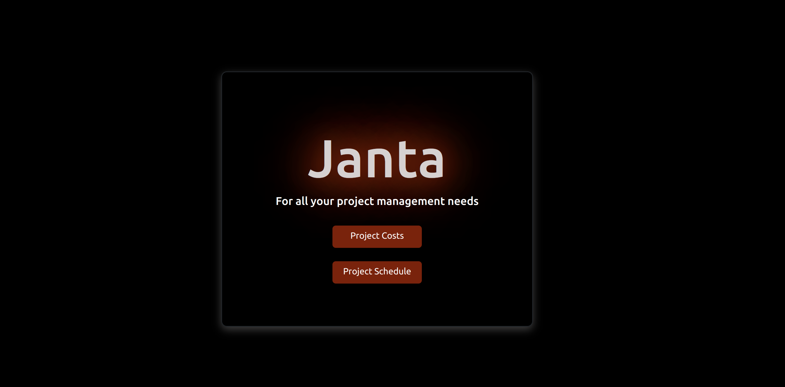

# Janta-App

---

### Author : Tim Mailu Date 14/9/2022

---

## Project Description

This is a project management web app where a user can create tasks, schedule and track the number of hours taken on a project as well as the cost o each project

---

## SCREENSHOTS

---

## SetUp Instruction

### Requirements

- Text editor eg [Visual Studio Code](https://code.visualstudio.com/download)

### Getting Files

- Fork the repo [LINK.](https://github.com/Tim254/JantaApp.git)

* Create a new branch in your terminal (git checkout -b improve-feature)
* Install the prerequisites
* Make appropriate changes in file(s)
* Run the server to see the changes
* Add the changes and commit them (git commit -am "Improve App")
* Push to the branch (git push origin improve-app)
* Create a Pull request
* Remember to also for the server from [LINK.](https://github.com/Tim254/phase-3-sinatra-react-project.git) and run it under its README.md instructions

- Open the folder location on terminal and use the following command to run app:

### Features

- Users can share their opinions under comment section by adding, creating, updating and deleting.
- Users can read posts about tech by the author/owner of the website:

## How To Run It

> $ type 'npm start' on your text edito commandline and hit enter.

---

## Live Link

Or you can access the web application directly via this [LINK.]()

---

## Technologies Used

1. JSX
2. CSS
3. React
4. Json
5. React Semantics
6. Sqlite3 server
7. Sinatra and Active Records

---

## Contact Information

- Email : timothy.mailu@student.moringaschool.com

---

## [License](LICENSE)

MIT License
Copyright (c) 2022 Tim Mailu